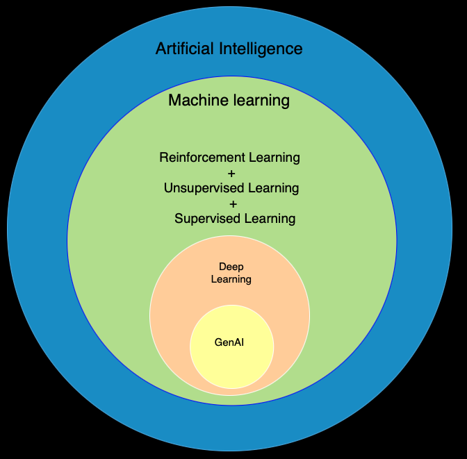
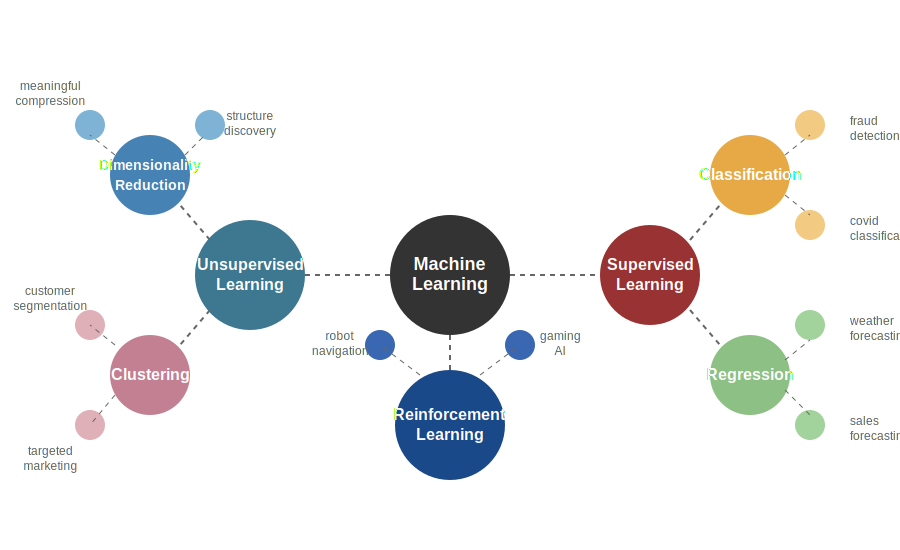
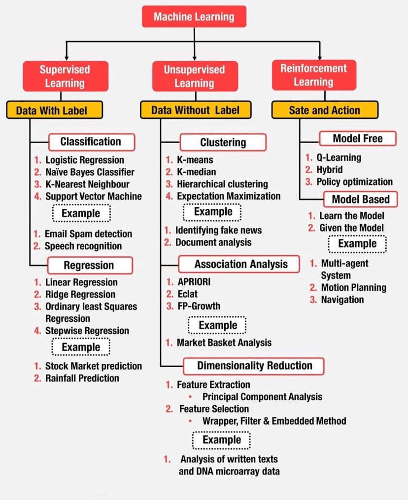
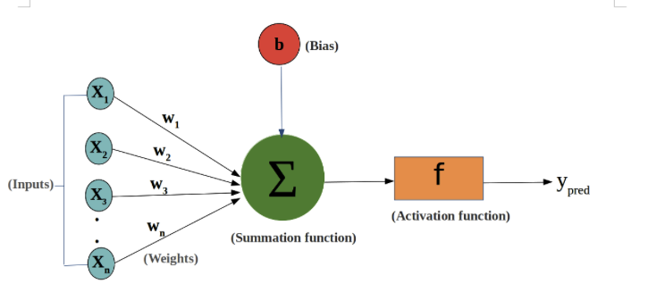
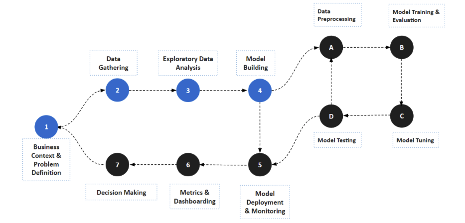

# Machine learning

AI is a branch of computer science that deals with the creation of intelligent agents, which are systems that can reason, learn and act autonomously. Essentially, AI has to do with the theory and methods to build machines that think and act like humans.

Machine learning is a subset of AI. It is a method where computers infer logic from data instead of being given explicit instructions. It allows computers to learn from input data and output results to determine the best set of instructions for future tasks. In other words, ML is a set of algorithms and techniques that enable systems to learn from data, recognize patters, and make predictions or decisions. It deals with stastical models, training processes, and optimization methods that allow AI systems to adapt, imporove and evolve.

Below are the three major branches of machine learning.

1. Supervised learning  
Supervised learning involves training a model with input data and the expected output. The model learns the relationship between the input and output to make predictions on new data.
Examples: Image recognition, text prediction, and spam filtering.
Two types of supervised learning:
    * **Classification** => Predicts a category or class (e.g., spam or not spam).
    * **Regression** => Predicts a continuous numerical value (e.g., house price).

2. Unupervised learning  
Unsupervised learning involves providing the machine with input data without labeled responses. The machine identifies hidden patterns or relationships in the data.
Examples: Movie recommendation systems and customer segmentation for marketing.  
Two types of unsupervised learning:  
    * **Clustering**: Groups data points into clusters based on their similarities, helping to identify patterns or structures in the data.  
    * **Dimensionality Reduction**: Reduces the number of features in a dataset while retaining its essential information, making it easier to visualize and analyze.  

3. Reinforcement learning  
Reinforcement learning involves an agent interacting with an environment, taking actions, and receiving feedback. The agent learns the optimal sequence of actions to achieve a goal through trial and error.
Examples: Computer game engines, robotics, and self-driving cars.  

4. Self-supervised learning  
Is a type of training in which the objective is automatically computed from the inputs of the model. That means that humans are not needed to label the data.    

## Steps in the Machine Learning Process  
1. Data collection - Gathering the necessary data for machine learning, whether labeled or unlabeled.

2. Data Exploration - Describing, visualizing, and analyzing data to better understand its characteristics.

3. Data Preparation - Data preparation is the process of making sure that our data is suitable for the machine learning approach that we intend to use. This involves dealing with data quality issues such as missing data.

4. Modeling - Choosing and applying the appropriate machine learning approach to solve the problem at hand.

5. Evaluation - Assessing the model's performance and iteratively improving it based on feedback.

## Visualizing data thorugh charts
Comparison Visualizations:  
Used to illustrate differences between items over time, such as box plots.

Relationship Visualizations:  
Show correlations between continuous variables, like scatter plots.

Distribution Visualizations:  
Illustrate the statistical distribution of feature values, with histograms.

Composition Visualizations:  
Display the component makeup of data, such as stacked bar charts.

These visualizations help in understanding data patterns and answering specific questions about the data.

# AI models are broadly classified as below based on the tasks they perform
1. Discriminative AI  
Discriminative AI models focus on categorizing input data or predicting future outcomes based on historical data.
Examples: In the context of text analytics or natural language processing, a discriminative model can label customer reviews of a local restaurant as satisfied, unsatisfied, or neutral based on the input text.

2. Generative AI  
Generative AI models are designed to create new content based on user input.
Examples: Generative AI can generate innovative texts, complete sentences, and craft entirely new pieces of writing. Large language models (LLMs) are a prominent example of generative AI, capable of understanding and generating human-like text based on input or prompts.

## Generative AI

### Overview
AI is a branch of computer science that delas with the creation of intelligent agents which are systems that can reason, learn and act autonomously.

Machine learning is a sub set of Aritifical intelligence. Algorithms and techniques that enable systems to learn from data, recognize patterns, and make predictions and decisions. It delas with stastical models, training processes, and optimization methods that allow AI systems to adapt.

Other sub fields of AI are natural language processing, computer vision and robotics.

In the context of Natural Language Processing, Generative AI models focus producing text that closely resembles human language.

Large Language Models are Generative AI models that are really good at undertsanding and generating humanlike text based on the input they receive called prompt. They are powered by **Transformer**, a type of neural network.

What's the difference between NLP and LLM -
* NLP (Natural Language Processing) is the broader field focused on enabling computers to understand, interpret, and generate human language. NLP encompasses many techniques and tasks such as sentiment analysis, named entity recognition, and machine translation.  
    - **Classifying whole sentences**  
        - Sentiment analysis of reviews
        - Spam detection in emails
        - Grammatical correctness checking
        - Determining logical relationships between sentences

    - **Classifying each word in a sentence**  
        - Part-of-speech tagging (noun, verb, adjective, etc.)
        - Named entity recognition (person, location, organization)

    - **Generating text content**  
        - Text completion from prompts
        - Filling in blanks with masked words

    - **Extracting an answer from a text**  
        - Question answering based on provided context

    - **Generating a new sentence from an input text**  
        - Machine translation
        - Text summarization
* LLMs (Large Language Models) are a powerful subset of NLP models characterized by their massive size, extensive training data, and ability to perform a wide range of language tasks with minimal task-specific training. Models like the Llama, GPT, or Claude series are examples of LLMs that have revolutionized what’s possible in NLP.

### Transfer learning or Fine tuning
**Pretraining** is the act of training a model from scratch: the weights are randomly initialized, and the training starts without any prior knowledge.

**Fine-tuning**, on the other hand, is the training done after a model has been trained. It's a technique that involves taking a general-purpose foundation model that has been pre-trained on a large and diverse data set and then adapting it to perform specific tasks. This process leverages the prior knowledge gained during the initial training phase and applies additional training using a smaller, domain-specific data set. This allows the model to specialize and excel in tasks relevant to a particular field, making it more effective and contextually relevant for specific applications.

Based on the fine-tuning appraoch LLMs can be grouped into below categories.
1. Generic Language Models
2. Instruction Tuned Language Models
3. Dialogue-Tuned (conversational) Language Models
4. Domain Specific Language Models

### Neural Networks in Generative AI
Deep learning is a subset of machine learning which inturn falls under the broader umberella of artifical intelligence. It is a subfiled of machine learning that involves training artifical neural networks with many layers (deep neural networks) to perform tasks such as image and speech recognition.

Large language models are powered by neural networks. A neural network in AI is a system modeled after the human brain's network of neurons. Large, because they are trained on large amounts of data, that means billions of trainable parameters. Language, because it deals with text data (takes input in text and generates output in text). Model, because it predicts the next word/sentence/token. So LLMs are language models consisting of a neural network with billions of parameters, trained on large quantities of unlabeled text using self-supervised learning.
The key terms in such a network are:

* Weights: Each input to a neuron is multiplied by a weight, which signifies the importance of that input.
* Bias: A bias term is added to the weighted sum of inputs to help the network make accurate predictions.
* Activation Function: This function processes the weighted sum of inputs and the bias to produce an output. Common activation functions include the sigmoid, hyperbolic tangent, and rectified linear unit (ReLU).

In essence, a neural network learns by adjusting these weights and biases to minimize the error in its predictions. This process involves iterative cycles of forward and backward propagation within epochs. During the forward phase, the network makes predictions, and in the backward phase, it adjusts the weights and biases to reduce the error, repeating this process across multiple epochs until the network reaches a satisfactory level of accuracy.

Transformer architecture, a neural network that uses self-attention to capture relationships between words. It covers the encoding and decoding components, positional encoding (word order), and how transformers generate output for tasks like language translation. They are the foundation of most large language models in use today. An encoder is a neural network that takes in a sequence of tokens (such as words or sub-words) and encodes them into a fixed-size vector representation that captures the contextual information of the input. A decoder is a neural network that takes the encoded representation generated by the encoder and uses it to generate output text. Decoders operate **auto-regressively**, meaning they generate one token at a time based on previously generated text. 
* Encoder-Decoder Model: BART, T5 (used for tasks like language translation, text summarization, an d question-answering systems)
* Encoder-Only Model: BERT, RoBERTa, DistilBERT (used for tasks like sentence classification, masked language modeling, and named entity recognition)
* Decoder-Only Model: GPT series (used for tasks like text generation and causal language modeling)

GANs (Generative Adversarial Networks) consist of two neural networks: a generator and a discriminator. The generator creates images (or other data) that look real, while the discriminator learns to tell real images apart from fakes. Through competitive learning, GANs can produce highly realistic synthetic images, audio, texts, and videos.

Both architectures are revolutionary in their respective domains but serve different purposes and operate differently.

## Model building  

## Libraries available for Machine Learning 
Scikit learn => Algorithms

Deep learning => Keras and TensorFlow (google) and  (meta) => Objective is same, using for deep learning
    1. PyTorch => by Meta => A toolbox that helps you build and train AI models

[Libs overview and comparision](docs/ml_libs.md)

## Challenges in AI systems

### Undertsanding hallucination in LLM
Hallucination is the phenomenon where AI models generate plausible but incorrect or nonsensical information.  

[**1. A brief summary of reasons why hallucinations occur in AI models**](docs/hallucination_reasons.md "A brief summary of reasons why hallucinations occur in AI models")

To-do:
What is stable diffusion? what are diffusion models?  
Supervised fine-tuning (SFT)  
Reinforcemnt learning with human feedback (RLHF)  
Distillation  
Tranformers pipeline  
Auto classes with the generate()  
Diffusion model  
Quantization - storing the LLM parameters or some of them in lower-bit representation  
RNN (Recurrent Neural Network) -   
Logits    

