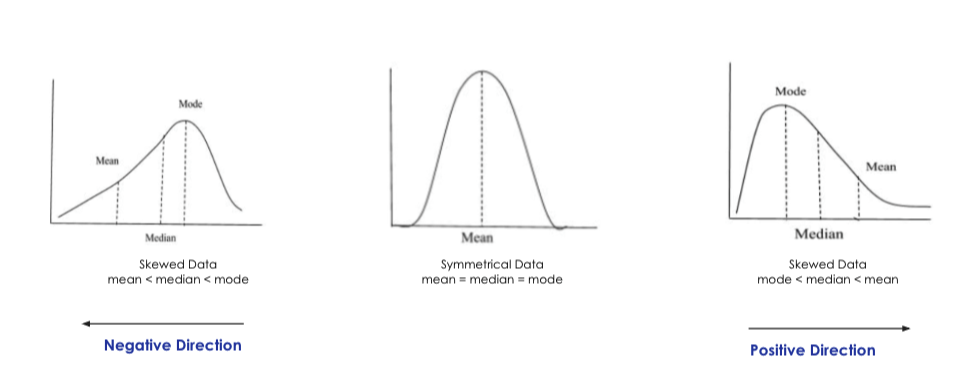

## Probability and statistics

### Probability, Conditional probability, Bayes Rule

$P(Probability\ of\ an\ event\ occurring) = \frac{\text{outcomes associated with the event}}{\text{Total of outcomes}}$.

Conditional Probability : The probability of an event happening, given that another event has already happened.  
$P(Probability\ of\ event\ A\ happening\ given\ B) = \frac{\text{Probability of both events A and B happening}}{\text{Probability of event B happening}}$.

Bayes Rule : Determine probability of a hypothesis based on prior knowledge and new evidence.  
$P(Probability\ of\ A\ happening\ given\ B) = \frac{\text{Probability of B happening given A  } * \text{  Probability of A happening}}{\text{Probability of event B happenning}}$.

### Types of statistics

#### Descriptive statistics
Central Tendency - Mean, Median, Mode.  
Dispersion - Variance, Range, Standard Deviation.   
Mean : A measure of the centre of the data, and is computed as the sum of all data points divided by the total number of data points. Sensitive to outliers.  
Median :  The middle value f the data when arranged in an order.    
Mode : Most frequently occuring value. Useful for categorical data (non numbers).   

#### Inferential statistics
Inferential statistics involves making predictions or inferences about a population based on a sample of data. It uses probability theory to estimate population parameters, test hypotheses, and make decisions.

Examples:  
1. **Hypothesis Testing**: Determining if a new drug is effective by testing it on a sample of patients and inferring the results for the entire population.  
2. **Confidence Intervals**: Estimating the average height of a population by calculating a range (e.g., 95% confidence interval) based on a sample.  
3. **Regression Analysis**: Predicting house prices based on features like size, location, and number of rooms using a sample dataset.  
4. **ANOVA (Analysis of Variance)**: Comparing the means of multiple groups (e.g., test scores of students from different schools) to determine if there are significant differences.

Inferential statistics helps generalize findings from a sample to a larger population while accounting for uncertainty.