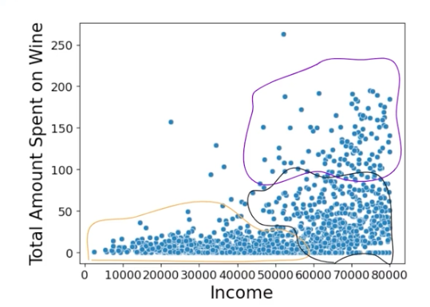
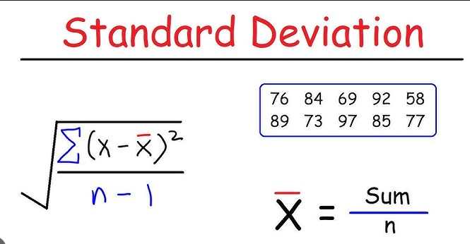
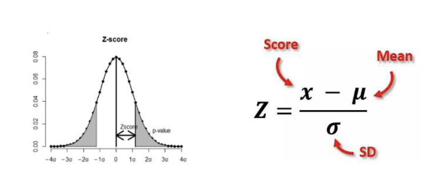
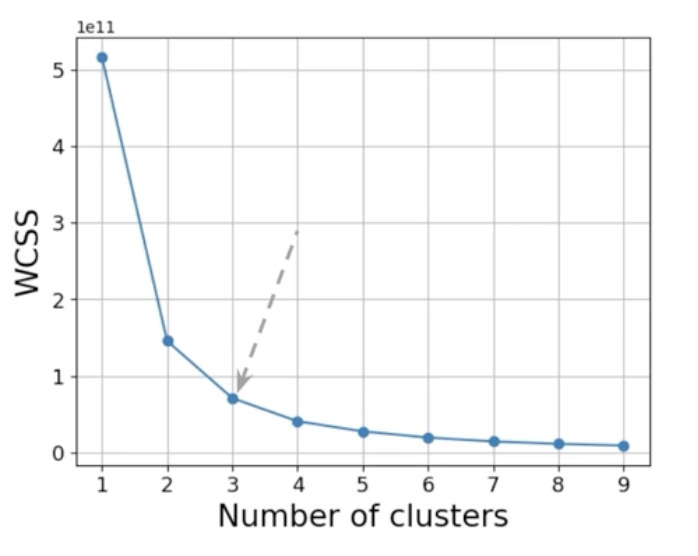
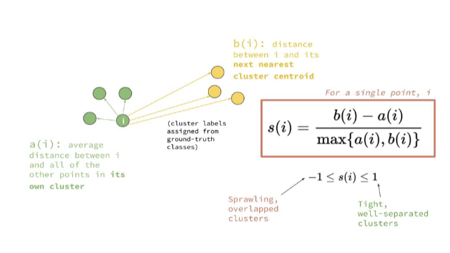
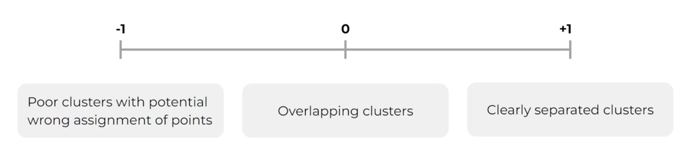

## Clustering

Clustering involves grouping data points with similar characteristics together. It is a method used in **unsupervised learning** and multivariate analysis, focusing on the similarity between data points, which is measured by distance. Clustering helps organize data into meaningful groups based on this similarity.

K-Means clustering, which is a popular algorithm where the number of clusters is specified in advance. The quality of clusters is crucial and must be evaluated using various metrics to ensure they make sense from a business perspective. Additionally, clustering is seen as a multivariate technique involving multiple dimensions, and techniques like t-SNE are used to reduce these dimensions for better visualization and interpretation. Defining the business problem and identifying relevant variables are essential steps in effective clustering, aiming for optimized and meaningful cluster formations.

Example problem spaces where clustering can be applied include:
1. Finance: Clustering is used for portfolio formation by categorizing assets into asset classes based on their risk and return profiles, aiding in diversified portfolio creation and effective risk management. It is also utilized in fraud detection through anomaly detection to identify patterns deviating from standard behavior.
2. Retail: Clustering helps optimize supply chain logistics and store layouts by understanding purchasing patterns and customer behavior. It supports customer segmentation for targeted marketing strategies, enhancing customer experience and operational efficiency.
3. Healthcare: In healthcare, clustering aids in genomic data analysis and patient segmentation. It helps personalize medicine, optimize healthcare facility resources, and improve patient management and treatment strategies.

Other common applications of clustering include, Customer Segmentation, Document Clustering, Image Segmentation, Recommendation Engines

### Distance Metrics

Distance metrics are described as mathematical measures used to quantify the closeness or similarity between data points. These metrics are crucial in clustering algorithms to determine how similar or different points are from each other. 
Commonly used distance metrics include:

1. Euclidean Distance (L2): This is a straight-line measure, often thought of as the “ordinary” distance between two points in Euclidean space. It’s calculated using the Pythagorean theorem.

Z-scoring, also known as standardization, is a statistical method used to transform data into a standard format where the mean of the data set is 0 and the standard deviation is 1. The formula to calculate a Z-score for a data point is:

$ Z = \frac{(X - \mu)}{\sigma} $

Where:
- ( X ) is the data point being standardized.
- $( \mu )$ is the mean of the dataset.
- $(\sigma)$ is the standard deviation of the dataset.  

The Z-score represents how many standard deviations a data point is from the mean of the dataset. If a Z-score is 0, it means the data point is at the mean; if it is positive, the data point is above the mean, and if negative, it is below the mean. Z-scoring is particularly useful in preparing data for clustering and regression analyses as it makes the data scale-independent, allowing for meaningful comparisons across different datasets.

2. Manhattan Distance (L1): This measure is based on grid-style paths, summing the absolute differences of their Cartesian coordinates. It represents the distance one would travel along axis-aligned paths (like city blocks, hence also called “taxicab” or “city block” distance)

**Below two are the related concepts (studied in Redis database documentation for vector search) -**

3. Cosine Similarity: This is a measure of similarity between two non-zero vectors. It calculates the cosine of the angle between the vectors, ranging from -1 to 1, where 1 indicates that the vectors are identical in orientation (but not necessarily magnitude), 0 indicates orthogonality, and -1 indicates opposite orientations. It is often used in text analysis and other applications to measure how similar two vectors are in terms of direction, irrespective of their magnitude.

4. Dot Product (Inner Product): This is a mathematical operation that takes two equal-length sequences of numbers (usually coordinate vectors) and returns a single number. The dot product is the sum of the products of the corresponding entries of the two sequences of numbers. It is used in various calculations, including determining the cosine similarity between vectors.

### Clustering algorithms in data analysis

#### **Connectivity-Based Clustering**
 
    Connectivity-based clustering, sometimes referred to as hierarchical clustering, focuses on the idea of forming clusters based on the proximity or connectivity of data points.

    Process:
    - Begins by calculating pairwise distances between all data points.
    - Groups points into clusters based on their proximity.
    - Iteratively merges pairs into triplets and larger groups, forming clusters that grow until a desired number of clusters or a stopping criterion is met.

    Characteristics:
    - Agglomerative: Starts with individual points in separate clusters and merges them incrementally.
    - Divisive: Starts with a single cluster and divides it into smaller clusters.
    - Ensures points within a cluster are more similar to each other compared to points in different clusters.

    Advantages:
    - Does not require specifying the number of clusters beforehand.
    - Effective for data with unknown or complex cluster shapes.

    Disadvantages:
    - Can be computationally intensive, especially with large datasets.
    - Sensitive to noise and outliers.

#### **Centroid-Based Clustering**

    Centroid-based clustering involves partitioning data into clusters based on representative points called centroids, with the most common approach being K-means clustering.

    Process:
    - Predefines the number of clusters ( k ).
    - Randomly assigns centroids and allocates each data point to the nearest centroid, forming clusters.
    - Iteratively recalculates the centroids based on the points assigned to them and reassigns points to the nearest centroid.
    - Continues until convergence or when there are no changes in cluster assignments.

    Characteristics:
    - Efficient in terms of computation as it reduces the complexity by focusing on distances between points and centroids rather than all pairwise distances.
    - Assumes clusters are spherical and evenly sized.

    Advantages:
    - Computationally efficient and scalable to large datasets.
    - Simple to implement and understand.

    Disadvantages:
    - Requires specifying the number of clusters (k) in advance.
    - May not perform well with non-spherical cluster shapes or varied cluster sizes.
    - Sensitive to initial placement of centroids and can get stuck in local minima.

### K-means clustering in detail

This is a type of centroid-based clustering where data is divided into K distinct clusters, each represented by a centroid that is the mean of the data points in that cluster.

    - Specify the Number of Clusters, K:
        Decide how many clusters you want the algorithm to find. This is a user-defined parameter.

    - Initialize Centroids:
        Choose K initial centroids. This can be done randomly or using more systematic methods like K-Means++ to improve outcomes.

    - Assign Points to the Nearest Centroid:
        For each data point, calculate the distance to each centroid.
        Assign the point to the cluster of the nearest centroid. Common distance metrics include Euclidean distance.

    - Recalculate Centroids:
        After all points are assigned, calculate the centroid of each cluster as the mean position of all the points within that cluster.

    - Iterative Process:
        Repeat the assignment of points and recalculation of centroids.
        Continue this process iteratively until the centroids stabilize (i.e., no longer change significantly) or a maximum number of iterations is reached.

    - Convergence Criteria:
        The algorithm is considered to have converged when the assignments of data points to clusters no longer change, or the changes fall below a certain tolerance.

    - Random Initialization and K-Means++:
        Random initialization can affect the outcome, leading to different clusters in different runs.
        K-Means++ is introduced as a method to improve initialization by placing centroids in a way that they are well-separated, helping the algorithm converge faster and result in better clustering.

K-means clustering thus organizes data points into K clusters, where each cluster minimizes the variance by grouping points around centroids based on their distances. This method is efficient but can require repetitions with different initializations to find the globally best solution.

#### How to find the optimal number of clusters in K-Means clustering

##### **Elbow Method**: 

- WCSS, or Within Cluster Sums of Squares, is calculated by first determining the centroid of each cluster, which represents the average position of all data points in that cluster. For each data point, the squared Euclidean distance to its cluster’s centroid is computed. These squared distances are then summed across all points within the cluster to arrive at the WCSS for that cluster. Summing the WCSS across all clusters gives the total WCSS, which reflects the compactness of the clustering configuration. 
    * High WCSS means the clusters are not very compact, and data points are spread out.
    * Low WCSS signifies the clusters are compact, and data points are close to their centroids.
$$
WCSS = \sum_{j = 1}^{k} \sum_{x_i \in C_j} (x_i - \overline{x_j})^2
$$

- This heuristic involves plotting the Within Cluster Sums of Squares (WCSS) against the number of clusters (K). 
- The idea is to identify the 'elbow' point on the graph, which is the point where the rate of decrease in WCSS sharply changes. 
- This elbow point indicates the optimal K, as adding more clusters beyond this point results in diminishing returns, meaning it does not significantly improve the clustering but increases complexity.

##### **Silhouette Score**: 
- This metric evaluates the quality of clusters by considering both the cohesion within clusters and the separation between clusters.
- Silhouette Score Formula

    The silhouette score 
    $$
    s(i) = \frac{b(i) - a(i)}{\max(a(i), b(i))}
    $$

    where:
    - s(i) is the silhouette score for data point i.
    - a(i) is the average distance from the data point i to all other points in the same cluster.
    - b(i) is the smallest average distance from the data point i to all points in any other cluster, where the point is not a member.
    - $\max(a(i), b(i))$ is used to normalize the score, making it range from -1 to 1.

    

    Silhouette score of a cluster is taken as the mean of silhouette scores of its data points.

- The silhouette score ranges from -1 to 1, where a score close to 1 indicates well-defined, well-separated clusters.  

. 

- Finding the optimal number of clusters involves choosing the K that maximizes the silhouette score, ensuring that clusters are both compact and distinct.

### Dimensionality Reduction

What is Data Recency?  
Data recency indicates how recent or up-to-date information is during analysis. In marketing, the RFM model is commonly used, emphasizing Recency, Frequency, and Monetary value to gain a comprehensive understanding of customer behavior. Incorporating additional variables beyond the primary ones can lead to new insights. However, visualizing data becomes challenging with more than three attributes, necessitating the use of dimensionality reduction techniques. 

Dimensionality reduction involves projecting high-dimensional data into lower dimensions, making it easier to model, reducing computational complexity, and allowing for effective visualization while preserving the data's essential structure and relationships.

#### t-SNE (t-distributed Stochastic Neighbor Embedding)

t-SNE is highlighted as a non-linear dimensionality reduction technique that helps map high-dimensional data into lower dimensions, keeping neighbor relationships intact. 
The process includes:
* Computing pairwise similarity distributions in high dimensions.
* Finding a close mapping of these in low dimensions.
* Minimizing divergence between these distributions to maintain clustering properties.

 Perplexity is a parameter in t-SNE that determines the size of the neighborhood considered during dimensionality reduction, influencing the quality of the visualization by balancing sparsity and density.

 ### Cluster Profiling

 Cluster profiling summarizes the characteristics of each cluster identified by a clustering algorithm. It analyzes central tendencies, variations, and distributions of numerical variables, as well as the frequencies and proportions of categorical variables within each cluster.

 ### Best video showig clustering technique
https://www.youtube.com/watch?v=nXY6PxAaOk0

### For additional dataset for practice
Use kaggle.com

