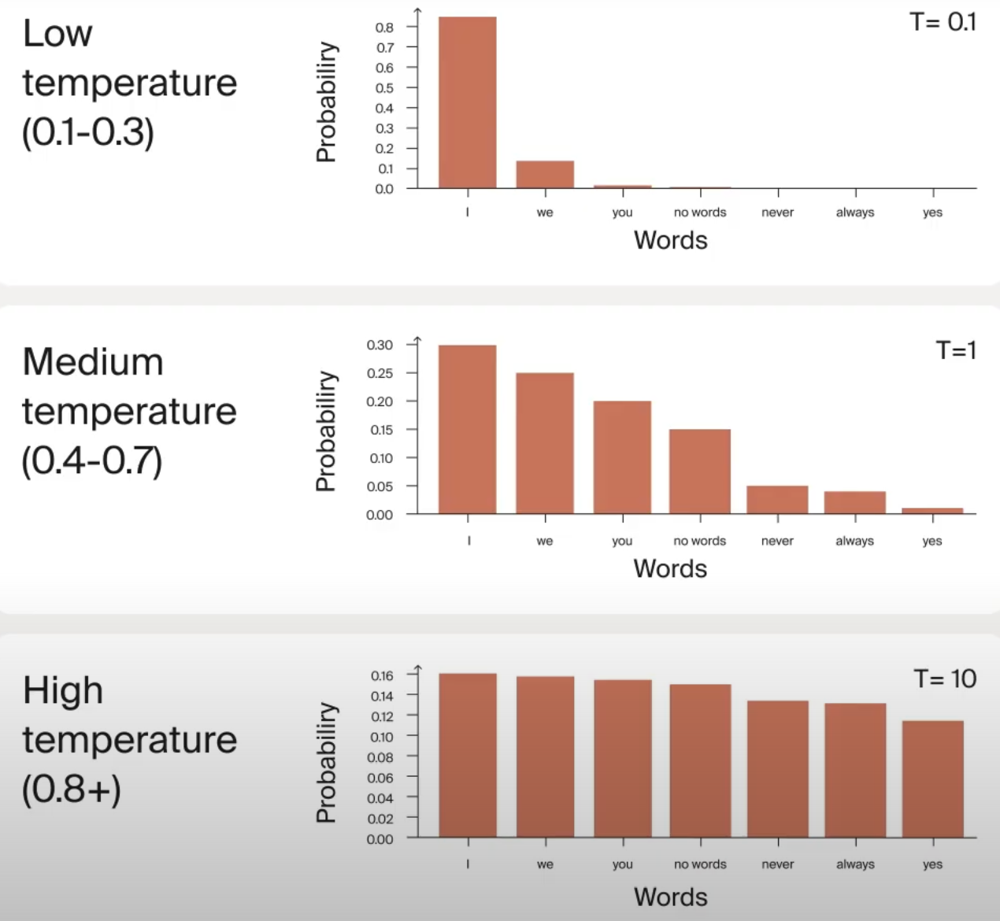

## Understanding Inference Parameters
### Temperature
This value defines how deterministic your answers will be. Higher the temperature, response/output will be more creative. Value ranges from 0 to 2.

Lower temperature sharpens the probability distribution making likely words more probable, which is perfect for tasks that require precision. Higher temperature flattens the distribution, giving the less likely words a better chance of being selected, which works well for creative writing.

### Maximum Tokens
Controls how long the model's response can be.

### Presence Penalty
This discourages the model from repeating words. Low value means the model can repeat words in its response.

### Top-p (nucleus sampling)
Limits the model's choices to words with cumulative probabilities that add up to a specified p-value.
Low Top-p (0.7): Considers a smaller set of probable words, leading to more focused and coherent responses.
High Top-p (0.9 - 1.0): Includes a broader range of words, allowing for more creativity and diversity in the output.

### Top-k Threshold
Restricts the model to choosing from the k most probable words at each step.
Low Top-k (e.g., 5): Yields predictable and precise responses.
High Top-k (e.g., 50): Increases diversity and richness in outputs.

## Zero-Shot and Few-Shot prompting

## References
https://futurecoding.ai/course-series/prompting