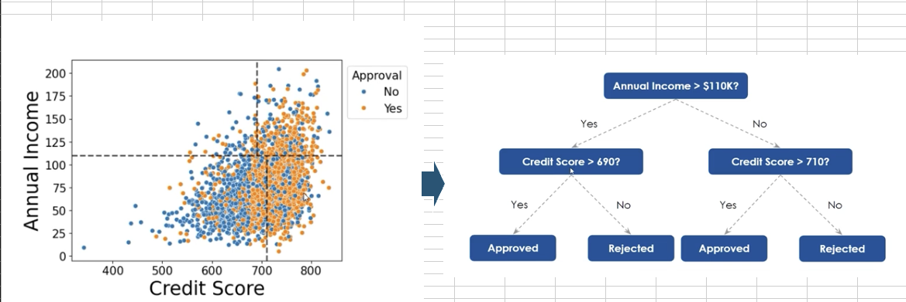
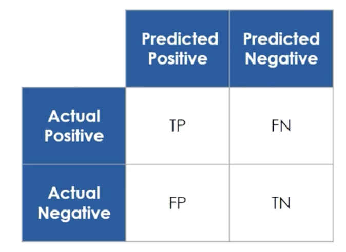
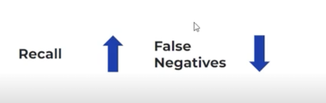
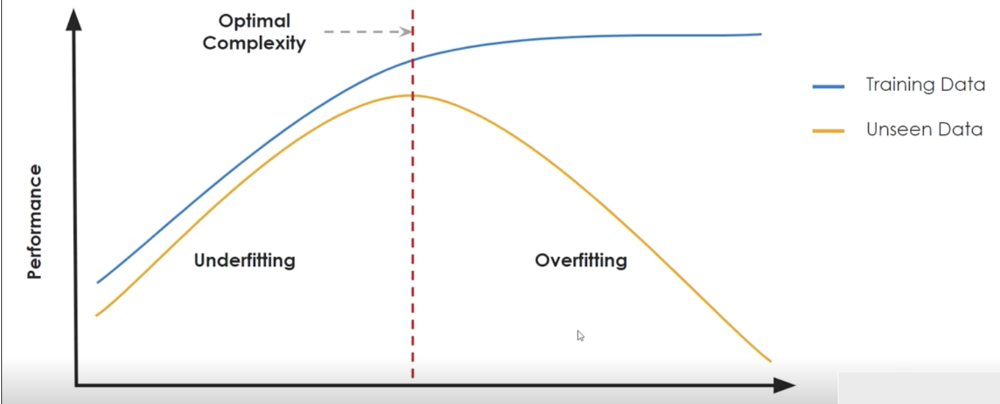
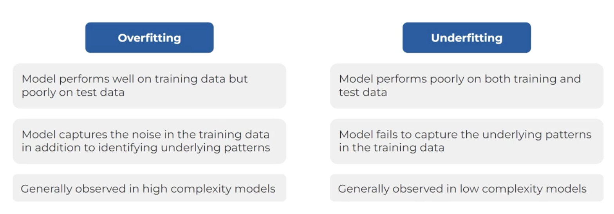
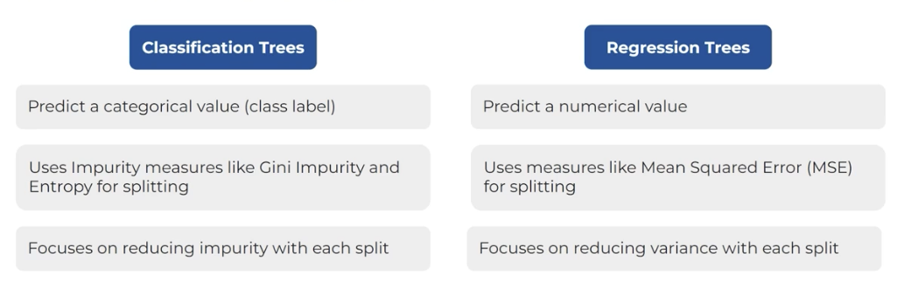

## Decision Trees for Classification

A decision tree is a graph-based model used for making decisions or predictions by mapping out different possible outcomes based on a set of input variables. It resembles a tree structure, where each internal node represents a decision point based on the value of an attribute, each branch represents the outcome of that decision, and each leaf node represents a final decision or classification. Decision trees are commonly used in classification and regression tasks due to their simplicity, interpretability, and ability to handle both numerical and categorical data. They enable the breakdown of complex decision-making processes into a series of simpler decisions, making them useful for predictive modeling.

Decision Trees (DTs) are a non-parametric supervised learning method used for classification (spam/not spam) and regression (pricing a car or a house).

Common terminologies used in DT:
1. Root Node: It represents the entire population or sample which gets divided into two or more homogeneous sets (branches or sub-trees).
2. Child and Parent Node: 
3. Branch /Subtree: 
4. Decision Node:
5. Leaf / Terminal Node:
6. Splitting: It is the process of dividing a node into two or more sub-nodes. The most widely used splitting criteria anre Gini-index and Information Gain.
7. Pruning: The process of removing the sub-nodes of a decision node. It is the opposite of the splitting process. This will help in tuning the tree to get a less biased decision.



### Impurity Measures

Impurity measures quantify how mixed or homogeneous the target variable is within a subset of data. When building a decision tree, the goal is to split the data in a way that reduces impurity in each resulting subset. Two commonly used impurity measures are:

1. **Gini Impurity**: Represents the probability of incorrectly classifying a randomly chosen element if it was randomly labeled according to the distribution of labels in the subset. In summary, it measures the chances of misclassification. A lower Gini impurity indicates higher homogeneity (purer nodes). Gini impurity ranges from 0 (completely pure) to a maximum of 0.5 (for a binary classification with perfectly mixed classes).

2. **Entropy**: Measures the level of disorder or unpredictability in the subset. Higher entropy means more mixed classes (less pure), while lower entropy means the subset is more homogeneous. Entropy ranges from 0 (pure) to 1 (maximally impure for binary classification).

Both measures are used to evaluate the quality of splits in decision trees, with lower values indicating better (purer) splits.

### Evalutation metrics for the decision trees

A confusion matrix is a tool used to evaluate the performance of a classification model. It provides a detailed breakdown of a model’s prediction outcomes against the actual values, allowing you to see how well the model distinguishes between classes. 

Example-


1. **Accuracy**: It is the proportion of correctly classified instances (both positive and negative) out of the total instances. Represents the proportion of correct predictions out of the total number of predictions.

$$
\text{Accuracy} = \frac{\text{TP + TN}}{\text{TP + TN + FP + FN}}
$$
Where <br>
TP - True Positives: Number of correctly predicted positive cases <br>
TN - True Negatives: Number of correctly predicted negative cases <br>
FP - False Positives: Number of negative cases incorrectly predicted as positive <br>
FN - False Negatives: Number of positive cases incorrectly predicted as negative <br>

$$
\text{Accuracy} = \frac{\text{Number of Correct Predictions}}{\text{Total Number of Predictions}}
$$

Value ranges from 0 to 1.

2. **Recall/Sensitivity**: Also called, sensitivity of the test. It tells us, out of all the positive instances, how many did the model remember correctly. It answers the question "Of all the actual positive instances, how many did I correctly identify?". Thus, recall/sensitivity computes the ratio of correctly predicted positive instances to all actual positives.

$$
\text{Recall} = \frac{\text{TP}}{\text{TP + FN}}
$$

Value ranges from 0 to 1.  
Higher the recall, lower the False negatives.  


3. **Precision**: The ratio of true positives to total predicted positives. It tells us out of all the predicted positives instances, how many are actually positive.It answers the question "Of all the instances I predicted as positive, how many were actually positive"?. Thus, precision computes the ratio of correctly predicted positive instances to all predicted positives.

$$
\text{Precision} = \frac{\text{TP}}{\text{TP + FP}}
$$

Ranges from 0 to 1.  


4. **F1 Score**: Maintains a balance between False Positives and False Negatives.

$$
\text{F1 Score} = 2 \times \frac{\text{Precision} \times \text{Recall}}{\text{Precision} + \text{Recall}}
$$

Ranges from 0 to 1.  


### Model complexity vs Performance

Complexity of a decision tree depends a lot on the depth of the trees. More depth the tree has, more complex it is.




### Pruning

Pruning is the process of removing parts of a decision tree that do not significantly improve the prediction of target variables. It reduces complexity and prevents overfitting.Essentially, pruning means not letting the decision tree grow beyond certain point.

Two techniques of pruning.

1. Pre-pruning - <br>
    Is a method which prevents the tree from growing fully by introducing a stopping criterion. <br>
    It is implemented by specifying parameters like tree depth, minimum leaves per node, and minimum data points to consider for splits.
    
    Below are the stopping criteria -  
    * Max depth - Sets the maximum depth to which a tree can grow. 
    * Minimum samples for leaf - Sets the minimum number of data points that need to be present for a node to be a leaf node.  
    * Min samples to split - Sets the minimum number of data points that need to be present for a node to be split further.  


2. Post-pruning - It is a process in which nodes and subtrees are replaced with leaves to reduce complexity. This technique adds a computational burden. 
    Two techniques in this -  
    * Cost complexity pruning - Balances tree complexity with classification accuracy by penalizing the number of nodes.  
    ⍺ (also called complexity parameter) controls the trade-off between the complexity of the tree and its performance.
        $$
        \text{⍺} = \frac{\text{Error(Pruned Tree) - Error(Original Tree)}}{\text{Number of nodes reduced}}
        $$
    Smallest ⍺ means smallest loss of performance per node drop.
    The lower the complexity parameter, the more complex the model is.
    We typically choose an optimal alpha by evaluating different alphas on a validation set to find the balance that provides the best performance on unseen data.  
    In summary, alpha is a crucial parameter in pruning decision trees as it helps find the right balance between a model’s complexity and its predictive ability, ensuring that the model generalizes well to new data.

    * Reduced Error Pruning - Identifies subtrees that do not improve accurcy on the validation set and prunes them.

### Hyperparameters
Hyperparameters are the parameters of the learning algorithm itself, which means they are not directly learned from the data but are set prior to the training process. These parameters influence the training process and the structure of the model, making them crucial in optimizing model performance. In other words,  hyperparameters are configuration settings that are external to the model and whose values cannot be estimated from the data. They are parameters that you, as the data scientist or machine learning engineer, set before the training process begins. Think of them as the knobs and dials you adjust to control how the model learns. This is in contrast to model parameters, which are learned automatically by the model during training from the data (e.g., the weights and biases in a neural network). Hyperparameters are usually set using techniques like cross-validation or grid search to find the best combination for the specific task.  

Here's an analogy:

Imagine you're teaching a student to learn a new skill, like playing a musical instrument.

* Model Parameters: The student's natural talent, their ability to learn from practice – these are internal and develop during the learning process.
* Hyperparameters: The number of hours they practice each day, the type of instrument they use, the teacher they have – these are external factors you decide beforehand that influence how well and how quickly they learn.

Choosing the right hyperparameters is crucial because they significantly impact the model's performance, training speed, and generalization ability (how well it performs on unseen data). The process of finding the best combination of hyperparameters is called hyperparameter tuning or optimization.

Example of hyperparameter in Decision Trees:
In decision trees, hyperparameters include the maximum depth of the tree (max_depth), the minimum number of samples required to split a node (min_samples_split), and the minimum number of samples required at a leaf node (min_samples_leaf). For instance, setting a max_depth can prevent overfitting by limiting the number of levels the tree can grow, ensuring the tree does not become too complex and capture noise in the training data.

By carefully tuning these hyperparameters, you can significantly affect the model’s performance and its ability to generalize well to unseen data. The process of trying different aspects of all these parameters can be referred to as "hyperparameer tuning". Grid Search is a process of searching the best combination of hyperparameters from a predefined set of values. In Python GridSearchCV() is an implementation of Grid Search with Cross Validation.

Cross validation is a mechanism that allows us to test a model repeatedly on data that was not used in training to build the model. A comon appraoch is simply to choose the tree with minimum cross validation error.

## Decision trees for regression


### Example of analyzing the dataset using the Decision Tree algorithm

**Import libraries:**  
Import all necessary libraries for data manipulation, visualization, and model building.

**Load data:**  
Load the credit card approval data into a pandas DataFrame.

**Data overview:**  
Understand the data by viewing the first/last rows, checking the shape, data types, and statistical summary, and checking for missing or duplicate values.

**Exploratory data analysis:**  
Perform univariate and bivariate analysis to understand the distribution of features and their relationship with the target variable.

**Data preparation for modeling:**  
Prepare the data by separating features and the target variable, creating dummy variables for categorical features, encoding the target variable, and splitting the data into training and test sets.

**Model building (default decision tree):**  
Build a Decision Tree model using default parameters and evaluate its performance.

**Model building (pre-pruning):**  
Build a Decision Tree model using pre-pruning techniques by iterating over different hyperparameters and selecting the best model based on the difference between training and test F1 scores. Evaluate its performance.

**Model building (post-pruning):**  
Build a Decision Tree model using post-pruning techniques by analyzing the cost complexity pruning path. Evaluate its performance.

**Model performance comparison and final model selection:**  
Compare the performance of the different Decision Tree models and select the best one.

**Feature importance:**  
Determine the importance of different features in the selected model.

**Predict on a single data point:**  
Demonstrate how to use the selected model to make predictions on a single data point.

**Business recommendations:**  
Provide business recommendations based on the analysis and the selected model.

**Finish task:**  
Summarize the findings and conclude the analysis.

### GridSearch example
``` python
import pandas as pd
from sklearn.model_selection import train_test_split, GridSearchCV
from sklearn.tree import DecisionTreeClassifier
from sklearn.metrics import recall_score

# Load the dataset
df = pd.read_csv('data.csv')

X = df[['SepalLengthCm', 'SepalWidthCm', 'PetalLengthCm', 'PetalWidthCm']]
y = df['Species']

X_train, X_test, y_train, y_test = train_test_split(X, y, test_size=0.2, random_state=42)
clf = DecisionTreeClassifier()

param_grid = {
    'max_depth' : [1, 2, 3],
    'min_samples_leaf': [2, 3, 5]
}
grid_search = GridSearchCV(clf, param_grid, scoring='recall_weighted', cv=5)
grid_search.fit(X_train, y_train)

best_params = grid_search.best_params_
best_recall = grid_search.best_score_
```


