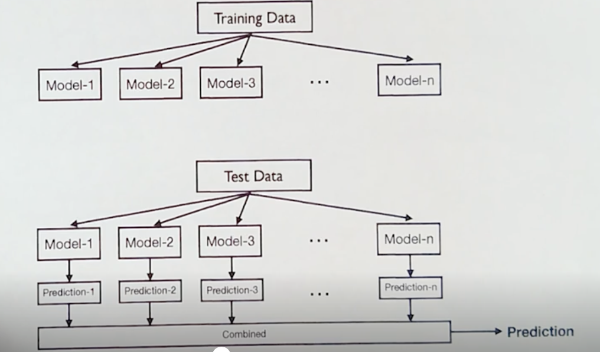

## Ensemble Techniques

**"ensemble"** comes from the French word "ensemble," which literally means "together".

Ensemble in machine learning approach involves training several different models and then aggregating their individual predictions to arrive at a final, more robust, and often more accurate prediction. This is a common technique in machine learning to improve model performance and handle complex data scenarios. The diversity among models is crucial for the success of ensemble techniques.

The central motivation is rooted under the belief that a committee of experts working together can perform better than a single expert. The effectiveness of ensemble techniques lies in their ability to reduce variance and improve prediction accuracy by leveraging the strengths of different models.

There are three primary methods for combining predictions from multiple models in ensemble techniques:

- **Voting:** Used for classification tasks, where each model casts a vote for a class label, and the class with the majority votes is selected as the final prediction.
- **Averaging:** Used for regression tasks, where the predictions from all models are averaged to produce the final output.
- **Weighted Averaging:** Similar to averaging, but each model's prediction is assigned a weight based on its performance or reliability, and the final prediction is a weighted sum of all model outputs.

Ensemble techniques require significant computational resources due to the need to train and combine multiple models. This increased computational demand is a trade-off for the improved accuracy and robustness that ensembles provide. While strong learners can be used in ensembles, they require more computational power, making them less practical in many cases. Instead, ensembles often rely on weak learners, which are simpler and faster to train. The computational cost of ensemble techniques is justified by the enhanced predictive performance they offer, making them a valuable tool in machine learning.

Bagging and boosting are two popular methods for constructing ensemble models. Bagging involves training models in **parallel**, using different subsets of the training data to ensure diversity. This method is commonly used in techniques like Random Forests. Boosting, on the other hand, involves training models sequentially, with each model focusing on correcting the errors of the previous ones. This approach can lead to highly accurate models by iteratively improving the ensemble's performance. Both bagging and boosting leverage the strengths of multiple models to create a robust and accurate ensemble.

### Bagging (Bootstrap Aggregating) and Random Forest
- Traditional single-model approaches (e.g., decision trees) can suffer from overfitting or underfitting and may not generalize well.
- Bagging (Bootstrap Aggregating) creates multiple models by randomly sampling the dataset with replacement, building each model on a different sample. "With replacement" means that once a data point is selected for a new bootstrap sample, it's "put back" into the original pool and can be selected again. In contrast to this is "without replacement," where each data point can only be selected once for a sample and is not returned to the pool after selection.
- "Bootstrap" means creating new datasets by sampling with replacement from the original data; in bagging, this generates diverse training sets for each model, improving generalization.
- Each model may overfit its sample, but aggregating their predictions reduces variance and improves generalization.
- Bagging is a parallel process; models are built simultaneously, not sequentially.
- Random Forest is a bagging technique using decision trees, adding further diversity by selecting random subsets of features for each tree split.
- Random Forests sample both rows (data points) and columns (features), increasing robustness and accuracy.
- Bootstrap sampling means some data points may appear multiple times in a sample, while others may not appear at all.
- Aggregating predictions from multiple models creates a strong, accurate, and less overfit ensemble.

**Note:** 
1. Bagging (homogeneous ensemble method):
Bagging is a homogeneous ensemble method, meaning it employs multiple instances of the same type of model or algorithm. For example, if decision trees are used in bagging, all models in the ensemble will be decision trees. The variation is achieved by training each model on different subsets of the data.
2. Heterogeneous Ensemble Models:
These models involve using different types of algorithms within the same ensemble. For instance, you could combine decision trees, logistic regression, and SVMs in one ensemble framework. This is not bagging but rather another ensemble method, such as stacking or voting.

#### Random Forest
* Bagging is a general ensemble technique. Random Forest is a specialized form of the Bagging method. It extends Bagging by not only using bootstrap sampling for creating different datasets but also incorporating the additional randomness of selecting a subset of features for each split in the decision trees. In summary, Random Forest can be considered a specific implementation of the Bagging ensemble technique, where the base learners are decision trees, and feature randomness is introduced to increase model robustness.
* Uses bagging by training each decision tree on a bootstrap sample (sampling with replacement).
* Trees are not pruned in Random forest because the overfitting will be reduced by averaging the predictions of multiple trees.
* At each split, a random subset of features is selected to determine the best split, increasing model diversity.
* The number of features considered at each split (m) is a key hyperparameter that affects performance.

### Comparison - Bagging vs Random Forest

| Aspect | Bagging | Random Forest |
|--------|---------|---------------|
| **Base Learner** | Any type of model (decision trees, logistic regression, SVM, etc.) | Specifically decision trees only |
| **Bootstrap Sampling** | ✅ Uses bootstrap sampling to create different subsets of training data | ✅ Uses bootstrap sampling to create different subsets of training data |
| **Feature Selection** | Uses all available features for each model | 🔄 **Additional randomness**: Uses random subset of features for each split |
| **Source of Diversity** | Diversity comes solely from different bootstrapped datasets | Diversity from both bootstrapped datasets AND random feature selection |
| **Prediction Method** | Majority voting (classification) or averaging (regression) | Majority voting (classification) or averaging (regression) |
| **Overfitting Control** | Reduces variance through ensemble averaging | Enhanced overfitting control due to dual randomness (data + features) |
| **High-Dimensional Data** | Standard performance with high-dimensional data | Better performance with high-dimensional data due to feature randomness |
| **Model Correlation** | Models may be more correlated if using same features | Lower correlation between trees due to feature randomness |
| **Flexibility** | More flexible - can use various base learners | Less flexible - limited to decision trees |

### Scikit Learn Implementations for Bagging and Random Forest

||Bagging|Random Forest|
|---|---|---|
| **Import** | `from sklearn.ensemble import BaggingClassifier` | `from sklearn.ensemble import RandomForestClassifier` |
| **Initialization (Default)** | `BaggingClassifier(random_state=1)` | `RandomForestClassifier(random_state=1)` |
| **Important Hyperparameters** | - `base_estimator`: The base model to use (default is Decision Tree).   - `n_estimators`: Number of base models to train (default is 100).   - `max_features`: Proportion of features to draw from the dataset for each base model (default is 1.0, meaning all features).   - `bootstrap`: Whether to use bootstrap sampling (default is True).   `bootstrap_features`: Whether features are drawn with replacement (default=False).   - `max_samples`: Proportion of samples to draw from the dataset for each base model (default is 1.0, meaning all samples).     - `n_jobs`: Number of jobs to run in parallel (default is None, meaning 1 unless in a joblib.parallel_backend context).   `oob_score`: Whether to use out-of-bag samples to estimate the generalization accuracy (default is False).   - `random_state`: Controls the randomness of the bootstrapping (default is None).    Use GridSearchCV( ) to find best estimator | - `n_estimators`: Number of decision trees in the forest (default is 100).   - `max_features`: The number of features to consider when looking for the best split (default is 'auto', which means `sqrt(n_features)` for classification).   - `class_weight`: Weights associated with classes in the form {class_label: weight}.If not given, all classes are supposed to have weight one.   - `bootstrap`: Whether bootstrap samples are used when building trees (default is True).   `max_samples`: If bootstrap is True, then the number of samples to draw from X to train each base estimator. If None (default), then draw N samples, where N is the number of observations in the train data.   `oob_score`: Whether to use out-of-bag samples to estimate the generalization accuracy (default is False).   - `criterion`: The function to measure the quality of a split (default is 'gini').   - `max_depth`: Maximum depth of the trees (default is None, meaning nodes are expanded until all leaves are pure or contain less than `min_samples_split` samples).   - `min_samples_split`: Minimum number of samples required to split an internal node (default is 2).   - `min_samples_leaf`: Minimum number of samples required to be at a leaf node (default is 1).     - `n_jobs`: Number of jobs to run in parallel (default is None, meaning 1 unless in a joblib.parallel_backend context).   - `random_state`: Controls the randomness of the bootstrapping (default is None).    Use GridSearchCV( ) to find best estimator | 
| **Feature Importance** | No feature importance attribute | `feature_importances_` attribute provides the importance of each feature in the model |

**Note** : Hyperparameter tuning is tricky and exhaustive in the sense that there is no direct way to calculate how a change in the hyperparameter value will reduce the loss of your model until you try those hyperparameters.  
The final results depend on the parameters used/checked using GridSearchCV.