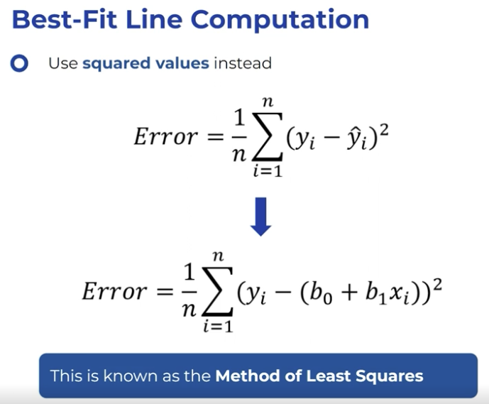
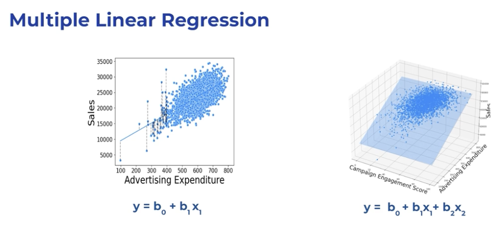
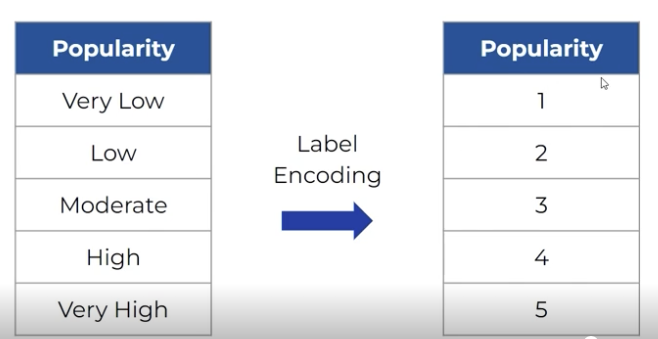
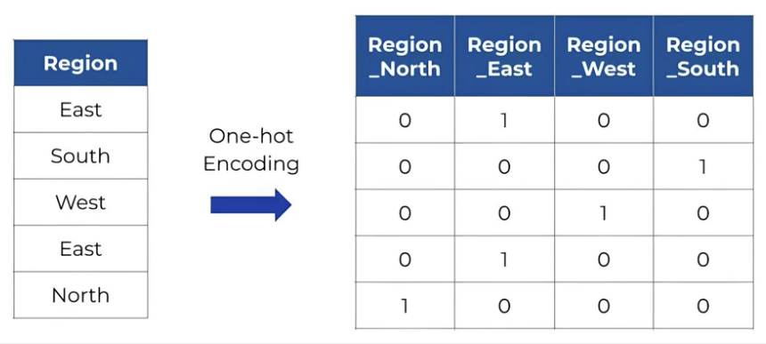
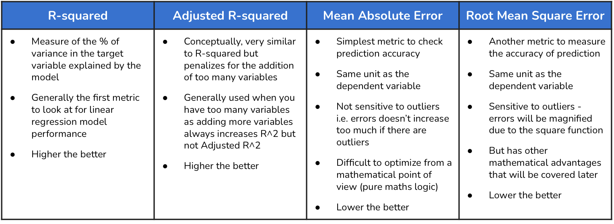

## Linear Regression

<u>**Linear regression**</u> is a fundamental supervised learning algorithm used to model the relationship between a dependent variable and one or more independent variables by fitting a straight line to the observed data. It is used to predict continuous outcomes and understand how changes in input features affect the output, making it valuable for tasks such as forecasting, trend analysis, and identifying correlations in data.

In the context of linear regression, a “best fit line” refers to a straight line that is drawn through a set of data points on a scatter plot to best represent the relationship between the independent variable (usually denoted as X) and the dependent variable (usually denoted as Y). The goal of this line is to minimize the difference between the observed values and the values predicted by the line.
The best fit line is usually determined using the method of least squares. This mathematical approach involves finding the line that minimizes the sum of the squares of the differences (errors) between the observed values and the values predicted by the line. This line is often called the “regression line.”  

  

In short, linear regression refers to finding the best-fitting straight line through the data points by minimizing the sum of squared differences between the observed and predicted values.

### <u>**Multiple linear regression**</u> 
extends simple linear regression by modeling the relationship between a dependent variable and two or more independent variables. Instead of fitting a line in two-dimensional space, it fits a hyperplane in higher dimensions. This approach allows the model to account for the influence of several features on the outcome simultaneously.

The general form of the multiple linear regression equation is:

```
Y = β₀ + β₁X₁ + β₂X₂ + ... + βₙXₙ + ε
```

Where:
- **Y** is the dependent variable,
- **X₁, X₂, ..., Xₙ** are independent variables,
- **β₀** is the intercept,
- **β₁, β₂, ..., βₙ** are the coefficients for each independent variable,
- **ε** is the error term.

Multiple linear regression is widely used for predicting outcomes and understanding the impact of several factors on a target variable, such as in economics, biology, and social sciences.  


### <u>**Categorical variables**</u> 
in regression are inlcuded by converting them to numerical representations.  

<u>Label encoding</u> -  <br>
If the categorical variable has a meaningful order (ordinal), use label encoding; if it is nominal (no inherent order), use one-hot encoding. <br>


<u>One-hot encoding</u> -  <br>
If the categorical variable has a meaningful order (ordinal), use label encoding; if it is nominal (no inherent order), use one-hot encoding. <br>


### <u>**Evaluation metrics for linear regression** -</u> <br> 
Evaluating the performance of linear regression models is essential to ensure their effectiveness. Performance is assessed by how well the model's predictions align with actual values. This involves using metrics that quantify prediction accuracy. A key aspect of evaluation is determining whether one model is better than another in terms of predictive accuracy. This is achieved by comparing how well different models predict outcomes, regardless of the specific explanatory variables involved. The evaluation process helps establish methods for selecting the most suitable model for a given predictive task.

<u>**Mean Absolute Error (MAE)** -</u> <br> 
Mean Absolute Error (MAE) is a metric used to evaluate the accuracy of a model's predictions. It measures the average magnitude of errors in a set of predictions, without considering their direction. MAE is calculated as the average of the absolute differences between predicted and actual values. This metric is intuitive and provides a straightforward way to compare models. A model with a lower MAE is considered better as it indicates smaller prediction errors. However, MAE does not penalize large errors more than small ones, which can be a limitation in some contexts.
<br>

The formula for Mean Absolute Error (MAE) is:

$$
\mathrm{MAE} = \frac{1}{n} \sum_{i=1}^{n} \left| y_i - \hat{y}_i \right|
$$

where:  
- $n$ is the number of data points  
- $y_i$ is the actual value  
- $\hat{y}_i$ is the predicted value

<u>**Root Mean Squared Error (RMSE)** -</u><br> 
Root Mean Square Error (RMSE) is another metric for evaluating prediction accuracy. Unlike MAE, RMSE penalizes larger errors more heavily by squaring the differences between predicted and actual values before averaging them. This makes RMSE sensitive to outliers and large deviations, providing a more stringent measure of prediction accuracy. RMSE is often preferred when large errors are particularly undesirable. However, because it involves squaring the errors, RMSE results are in squared units, which can complicate interpretation. Taking the square root returns the metric to the original scale of the data.
<br>

The formula for Root Mean Squared Error (RMSE) is:

$$
\mathrm{RMSE} = \sqrt{ \frac{1}{n} \sum_{i=1}^{n} (y_i - \hat{y}_i)^2 }
$$

where:  
- $n$ is the number of data points  
- $y_i$ is the actual value  
- $\hat{y}_i$ is the predicted value  

<u>**Mean Absolute Percentage Error (MAPE)** -</u> <br>
Mean Absolute Percentage Error (MAPE) is a metric that expresses prediction errors as a percentage of the actual values. This normalization allows for comparisons across different scales and datasets. MAPE is calculated by dividing the absolute error by the actual value and multiplying by 100 to express it as a percentage. This metric is useful for understanding the relative size of errors, making it easier to interpret in practical terms. However, MAPE can be problematic when actual values are close to zero, as it can lead to disproportionately large percentage errors.
<br>

The formula for Mean Absolute Percentage Error (MAPE) is:

$$
\mathrm{MAPE} = \frac{1}{n} \sum_{i=1}^{n} \left| \frac{y_i - \hat{y}_i}{y_i} \right| * 100
$$

where:  
- $n$ is the number of data points  
- $y_i$ is the actual value  
- $\hat{y}_i$ is the predicted value  

<u>**R Sqaured** -</u> <br>
R-squared is a statistical measure that represents the proportion of variance in the dependent variable that is predictable from the independent variables. It provides insight into how well the explanatory variables explain the variability of the response variable. An R-squared value close to 1 indicates that a large proportion of the variance is explained by the model, while a value close to 0 suggests little explanatory power. R-squared is widely used to assess the goodness of fit of a model, but it can be misleading if additional variables are added without improving the model's explanatory power.
<br>

The formula for R-squared ($R^2$) is:

$$
R^2 = 1 - \frac{\sum_{i=1}^{n} (y_i - \hat{y}_i)^2}{\sum_{i=1}^{n} (y_i - \bar{y})^2}
$$

where:  
- $n$ is the number of data points  
- $y_i$ is the actual value  
- $\hat{y}_i$ is the predicted value  
- $\bar{y}$ is the mean of the actual values  

<u>**Adjusted R Sqaured** -</u> <br>
Adjusted R-squared is a modified version of R-squared that accounts for the number of explanatory variables in a model. It adjusts the R-squared value to reflect the addition of variables, penalizing models that include unnecessary predictors. This adjustment helps prevent overfitting by ensuring that only variables that contribute meaningful explanatory power are included. Adjusted R-squared can decrease if a new variable does not improve the model, providing a more accurate measure of model quality. It balances model fit with complexity, aiding in the selection of the most parsimonious model.
<br>

The formula for Adjusted R-squared ($\bar{R}^2$) is:

$$
\bar{R}^2 = 1 - \left(1 - R^2\right) \frac{n - 1}{n - k - 1}
$$

where:  
- $R^2$ is the R-squared value  
- $n$ is the number of data points  
- $k$ is the number of independent variables  

### Summary
The two main objectives of linear regression discussed in the video are:

1. Predicting or Forecasting the Value of the Outcome Variable: Linear regression aims to predict the outcome variable’s value based on the explanatory variables. This involves creating a model that best fits the observed data, allowing for accurate predictions.

2. Identifying Key Drivers of the Outcome Variable: Linear regression helps identify which explanatory variables significantly impact the outcome variable. By analyzing the coefficients and effects of these variables, one can determine the key factors driving changes in the outcome variable.



### Note
In a linear relationship, the variables are only raised to the power of one.

The choice of metric in Regression depends on the specific goals of the analysis. For instance, RMSE (Root Mean Sqaured Error) and MAE (Mean Absolute Error) focus on prediction accuracy, while R-Sqaured measures the proportion of variance explained by the model.

Test data is used to evaluate the performance of the trained model on unseen data. It helps assess how well the model generalizes to new observations.

R-squared generally ranges from 0 to 1, where 0 indicates that the model does not explain any variability in the target variable, and 1 indicates a perfect fir where all variability is explained.

In regression models:
* “Coefficients” and “intercept” are referred to as the model’s parameters.
* In a linear regression model:
    * Coefficients represent the weights assigned to each independent variable.
    * The intercept is the constant term that adjusts the prediction to fit the data.
* The learning process: Involves adjusting these parameters.
Aims to accurately represent the relationship between independent and dependent variables.
* Goal: To find the optimal set of parameters that minimize prediction error for the dataset.

1 Questions -  
<1> Evaluation metrics, needs explanation.  
<2> Ask for quick gradient descent explanation.  
<3> pd.dummies vs OneHotEncoder.  
<4> LabelEncoder vs using map on data frame. 

### Linear Regression Analysis Outline

Here's a structured outline for the linear regression analysis, represented as a flow chart for easy understanding and future editing.

1. Problem and Data:  
Understand goal: forecast sales, find influencers.  
Review objectives: sales forecast, key factors.  
Know data meaning (Data Dictionary).  

2. Load and Inspect:  
Import libraries.  
Load data (Sales.csv).  
Copy data.  
Check first rows (.head()).  
Get shape (.shape).  
See types (.info()).  
Summarize numbers (.describe()).  

3. Clean Data:  
Check missing (.isnull().sum()).  
Check duplicates (.duplicated().sum()).  

4. Explore Data (EDA):  
Univariate: Histograms (numbers), Box plots (numbers), Count plots (categories).  
Bivariate: Pair plots, Correlation heatmap, Box plots (Sales vs categories).  

5. Prepare for Model:  
Define X (features), y (target).  
Encode Popularity (label).  
Encode Region (one-hot).  
Split data (train/test).  

6. Build Models:  
Simple LR (Sales vs single feature).  
Multiple LR (Sales vs feature combinations).  
Multiple LR (Sales vs all features).  
For each: Create, Fit, Print coefficients/intercept, (Plot for simple LR).  

7. Evaluate Models:  
Define MAPE, Adjusted R-squared functions.  
Define function for all metrics (RMSE, MAE, MAPE, R2, Adj R2).  
Evaluate each model (train/test sets).  

8. Compare Models:  
Compare train performance table.  
Compare test performance table.  
Identify best model.  
Interpret influential factors.  

