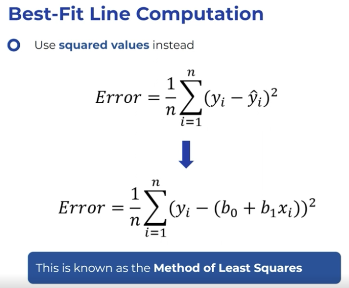
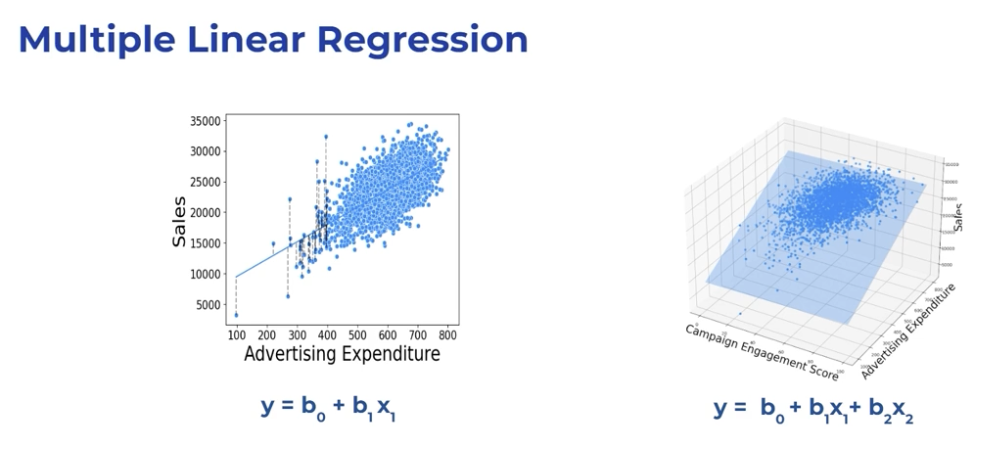

## Machine learning concepts

Machine learning enables computers to learn from data, where supervised learning learns from labelled data, and unsupervised leans from unlablled data

### Data, Noise, Training and Testing data
Data usually contains information and noise.   
Splitting information from noise is at the heart of ML.  
To help do this, machine learning uses a train and test approach.

### Overfitting vs Underfitting
Overfitting refers to a model that models the training data too well. Underfitting refers to a model that can neither model the training data nor generalize to new data.

| Aspect                | Overfitting                                                                                                                                         | Underfitting                                                                                                         |
|-----------------------|-----------------------------------------------------------------------------------------------------------------------------------------------------|----------------------------------------------------------------------------------------------------------------------|
| **Definition**        | A model is overfitting when it learns both the noise and the patterns in the training data too well, capturing too many data fluctuations.           | A model is underfitting when it cannot capture the underlying pattern of the data, resulting in a model that is too simple. |
| **Impact on Training Data** | High accuracy because it fits the training data almost perfectly.                                                                                   | Low accuracy as it fails to capture the patterns in the training data.                                               |
| **Impact on New Data**| Poor performance on new, unseen data due to capturing noise instead of the underlying data distribution.                                             | Poor performance on new data as it fails to generalize from the training data.                                       |
| **Model Complexity**  | Excessively complex model with a high number of parameters.                                                                                         | Too simplistic model with insufficient parameters to capture the complexity of the data.                             |
| **Solution**          | Techniques like pruning, cross-validation, regularization, or reducing the model complexity.                                                        | Increasing model complexity, adding parameters, or using more sophisticated algorithms.                              |

Overfitting results in a model that performs well on training data but poorly on new data, while underfitting leads to a model that performs poorly on both training and new data. The goal is to find a balance between these two extremes to create a model that generalizes well to new data.

#### Model Complexity vs. Prediction Error
Understanding the relationship between model complexity and prediction error is crucial in machine learning. Model complexity refers to the capacity of a model to fit data, often determined by the number of parameters or the depth of the learning model. As model complexity increases, the prediction error typically follows a U-shaped curve. Initially, as complexity increases, the model better captures the underlying patterns in the data, leading to decreased prediction error on both training and test datasets. However, beyond a certain point, increased complexity results in overfitting, where the model captures noise rather than the actual signal, increasing prediction error on unseen data.  

<u>Measure of Success</u>: A successful model achieves an optimal balance between underfitting and overfitting, minimizing prediction error on the validation or test dataset. This typically occurs at the lowest point of the curve on the graph, representing the model’s ability to generalize well to new data.

  

## Machine learning types

### Linear Regression
<u>**Linear regression**</u> is a fundamental supervised learning algorithm used to model the relationship between a dependent variable and one or more independent variables by fitting a straight line to the observed data. It is used to predict continuous outcomes and understand how changes in input features affect the output, making it valuable for tasks such as forecasting, trend analysis, and identifying correlations in data.

In the context of linear regression, a “best fit line” refers to a straight line that is drawn through a set of data points on a scatter plot to best represent the relationship between the independent variable (usually denoted as X) and the dependent variable (usually denoted as Y). The goal of this line is to minimize the difference between the observed values and the values predicted by the line.
The best fit line is usually determined using the method of least squares. This mathematical approach involves finding the line that minimizes the sum of the squares of the differences (errors) between the observed values and the values predicted by the line. This line is often called the “regression line.”  

  

<u>**Multiple linear regression**</u> extends simple linear regression by modeling the relationship between a dependent variable and two or more independent variables. Instead of fitting a line in two-dimensional space, it fits a hyperplane in higher dimensions. This approach allows the model to account for the influence of several features on the outcome simultaneously.

The general form of the multiple linear regression equation is:

```
Y = β₀ + β₁X₁ + β₂X₂ + ... + βₙXₙ + ε
```

Where:
- **Y** is the dependent variable,
- **X₁, X₂, ..., Xₙ** are independent variables,
- **β₀** is the intercept,
- **β₁, β₂, ..., βₙ** are the coefficients for each independent variable,
- **ε** is the error term.

Multiple linear regression is widely used for predicting outcomes and understanding the impact of several factors on a target variable, such as in economics, biology, and social sciences.  


<u>**Categorical variables**</u> in regression are inlcuded by converting them to numerical representations.  

<u>Label encoding</u> -  


<u>One-hot encoding</u> -  

