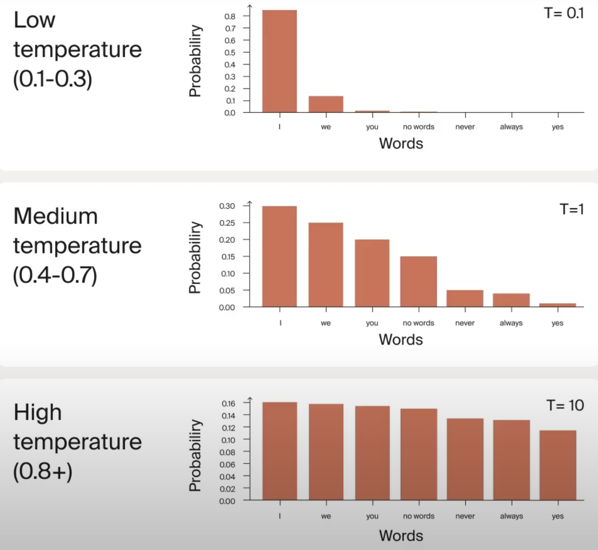

## Understanding Inference Parameters
### Temperature
This value defines how deterministic your answers will be. Higher the temperature, response/output will be more creative. Value ranges from 0 to 2.

Lower temperature sharpens the probability distribution making likely words more probable, which is perfect for tasks that require precision. Higher temperature flattens the distribution, giving the less likely words a better chance of being selected, which works well for creative writing.

### Maximum Tokens
Controls how long the model's response can be.

### Presence Penalty
This discourages the model from repeating words. Low value means the model can repeat words in its response.

### Top-p (nucleus sampling)
Limits the model's choices to words with cumulative probabilities that add up to a specified p-value.  
Low Top-p (0.7): Considers a smaller set of probable words, leading to more focused and coherent responses.  
High Top-p (0.9 - 1.0): Includes a broader range of words, allowing for more creativity and diversity in the output.  

### Top-k Threshold
Restricts the model to choose from the k most probable words at each step.  
Low Top-k (e.g., 5): Yields predictable and precise responses.  
High Top-k (e.g., 50): Increases diversity and richness in outputs.  

# Sampling Parameters in Language Models

This table compares the three main sampling parameters used during text generation with language models: `temperature`, `top-k`, and `top-p`.

| Parameter     | Purpose                            | Behavior                                     | Example Setting | Effect Description                                               |
|---------------|------------------------------------|----------------------------------------------|------------------|------------------------------------------------------------------|
| `temperature` | Controls randomness in sampling     | Scales the logits before sampling            | `temperature=0.7` | Lower values = more deterministic; higher = more diverse output |
| `top-k`       | Limits to top k likely tokens       | Selects from top `k` highest probability tokens | `top_k=50`       | Only considers the top 50 tokens for sampling                   |
| `top-p`       | Nucleus sampling (probability mass) | Selects smallest set with cumulative prob ≥ `p` | `top_p=0.9`      | Dynamically includes tokens until 90% of total probability is reached |

---

## Prompting techniques
**Few-shot prompting** involves providing examples to guide the AI in producing accurate, structured, and context-specific outputs.  

**Zero-shot prompting** involves providing clear instructions without examples. The AI uses its training data to generalize and generate responses.  

**Chain-of-thought prompting** guides AI in breaking down complex problems into smaller steps. Instead of providing just the final answer, the AI explains the reasoning behind it, which is particularly useful for tasks like math, programming, and reasoning. 

**Problem decomposition** prompting breaking down big tasks into smaller, manageable subtasks. Example laying down steps to build a data visualization code. (Step1) Data loading function (step 2) Data preprocessing (step 3) Analysis functions (step 4) Visualization (step 5) Final integration 

**Constitutional prompting** s a type of problem decomposition that provides the AI with a set of guiding principles before it generates a response. These rules can include ethical, stylistic, or functional guidelines to align the output with specific needs.  

**Plan-and-solve prompting** focuses on creating a detailed plan before tackling a problem. This method ensures clarity and precision, making it particularly effective for complex tasks.

**ReAct (Reason and Act) prompting** Thought-Action-Observation style of prompting.  
    * Reasoning traces  
    * Task-specific actions  
    * Dynamic adjustments  
    * External interactions  
    * Enhanced outcomes  

## References
https://futurecoding.ai/course-series/prompting